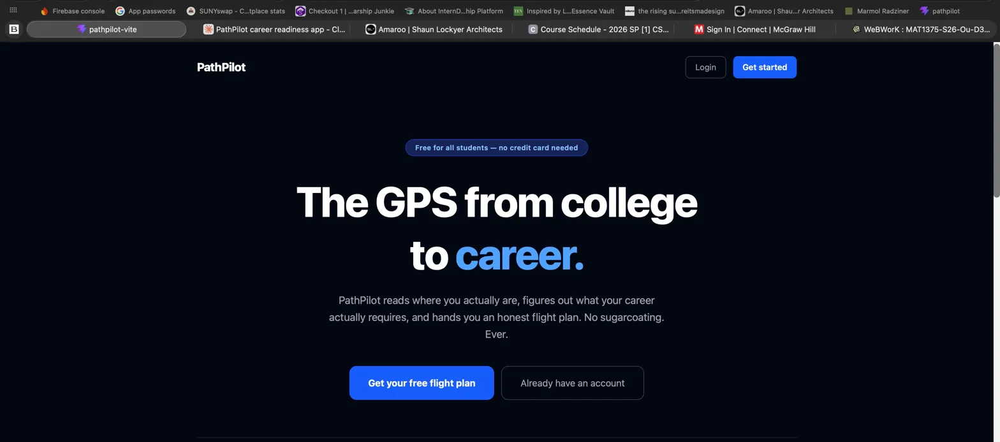
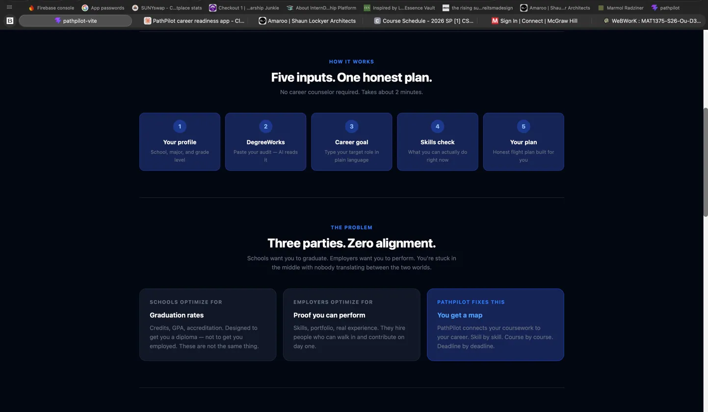
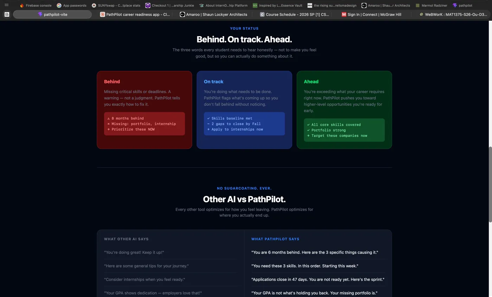
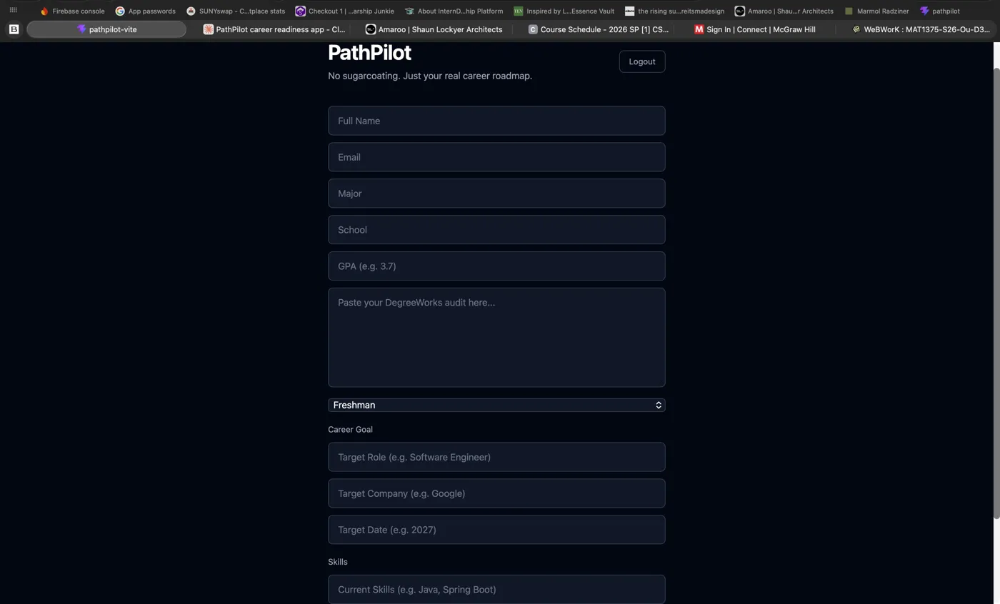
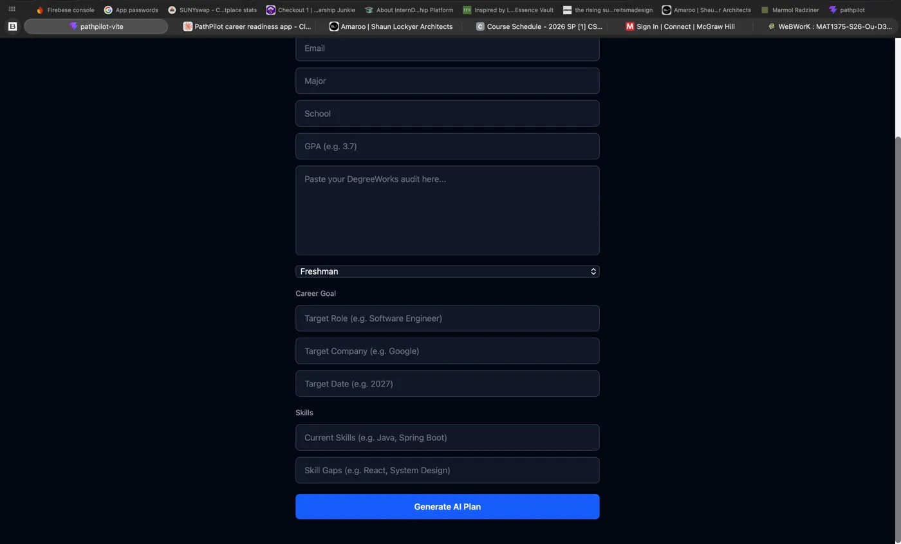
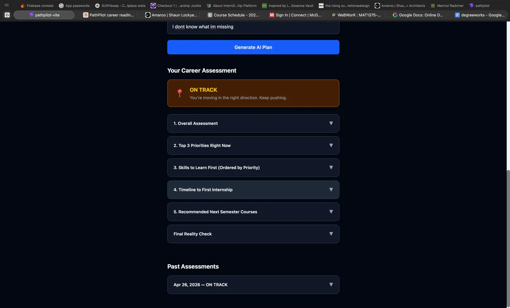
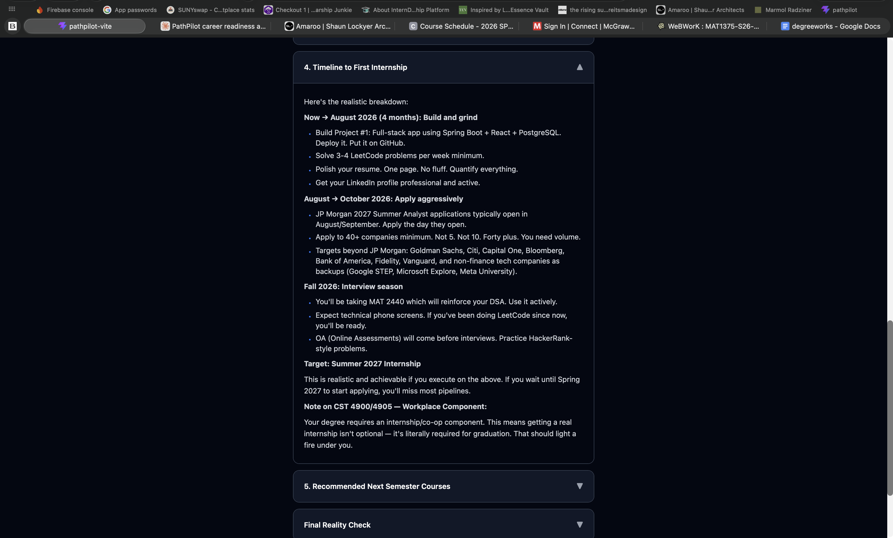

 PathPilot
> The GPS from college to career.

Every student. Every major. Every school.

PathPilot reads where you actually are, figures 
out what your career actually requires, and hands 
you the exact flight plan — no sugarcoating. Ever.

🔗 Live: https://path-pilot-rho.vercel.app

---

## The Problem

Schools optimize for graduation. Employers optimize 
for performance. Students are stuck in the middle 
with nobody translating between the two worlds.

Your curriculum was designed to get you a diploma 
— not get you employed. Those are not the same thing.

**PathPilot closes that gap.**

---

## What It Does

A student enters their profile, pastes their 
DegreeWorks academic audit, picks their career goal, 
and completes a quick skills check. PathPilot's AI 
reads all of it, analyzes what their target career 
actually requires, finds the exact gap, and delivers 
one honest flight plan.

Not a template. Not generic tips. A personalized 
roadmap built for that specific student's exact 
situation — with a clear status:

- ⚠️ **Behind** — missing critical skills or 
  deadlines. Here's exactly how to fix it.
- 📍 **On Track** — doing what needs to be done. 
  Here's what's coming up next.
- 🚀 **Ahead** — exceeding requirements. Here are 
  higher-level opportunities you're ready for now.

No sugarcoating. Ever.

---

## Screenshots

### Landing page


### How it works


### Status system


### Student profile input


### Student profile input


### AI-generated career assessment


### Generated plan


---

## Tech Stack

| Layer | Technology |
|-------|------------|
| Backend | Java 17, Spring Boot, REST API |
| Database | PostgreSQL (Railway) |
| Frontend | React + Vite (Vercel) |
| AI | Claude API (Anthropic) |
| Auth | JWT + Spring Security |
| Railway, Vercel, GitHub 

---

## Key Features

- **JWT authentication** — register, login, 
  protected routes, 7-day tokens
- **DegreeWorks parsing** — student pastes their 
  academic audit, Claude reads and extracts 
  everything automatically
- **Grade level aware** — Freshman through Senior, 
  urgency and tone adjust automatically based 
  on runway
- **Honest status system** — Behind / On Track / 
  Ahead determined by real gap analysis, 
  not GPA
- **Plan history** — every assessment saved with 
  timestamp, track progress over time
- **Works for every major** — Nursing, CS, Finance, 
  Pre-Law, Education, Engineering, and more
- **No sugarcoating** — PathPilot tells students 
  the truth so they can act on it

---

## How It Works

```
Student inputs 5 things:
1. Profile — school, major, grade level
2. DegreeWorks — paste academic audit
3. Career goal — type target role freely
4. Skills check — what they can actually do
5. Submit → Claude generates flight plan

Backend flow:
POST /students → save profile to PostgreSQL
POST /students/{id}/ai-plan →
  build prompt from student data →
  WebClient → Anthropic API →
  Claude analyzes gap →
  parse STATUS line →
  save to PlanHistory →
  return flight plan to frontend

Frontend:
Parse STATUS → render badge
Parse ## sections → render accordions
Refresh history → show past assessments
```

## API Endpoints

```
POST   /auth/register
POST   /auth/login
POST   /students
GET    /students/me
PUT    /students/{id}
POST   /students/{id}/ai-plan
GET    /students/me/plans
```

## Architecture

```
React + Vite (Vercel)
        ↓
Spring Boot REST API (Railway)
        ↓
PostgreSQL (Railway)
        ↓
Claude API (Anthropic)

Security flow:
Request → JwtAuthFilter → extract email →
SecurityContext → Controller →
Repository → Database
```

## Data Model

```
User
├── id, name, email, password (BCrypt)

Student
├── id, name, email, major, school, gpa
├── degreeWorksText (TEXT column)
├── gradeLevel (FRESHMAN → SENIOR enum)
├── careerGoal (embedded — role, company, date)
└── skillProfile (embedded — skills, gaps)

PlanHistory
├── id, studentEmail
├── planText (TEXT column)
├── status (BEHIND / ON TRACK / AHEAD)
└── createdAt (LocalDateTime)
```